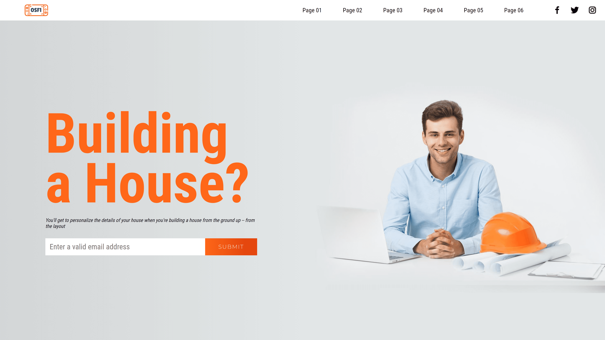

# Building-a-House

 
Construction of a Web Frontend, using the **SASS** preprocessor that allows the automatic generation of style sheets, adding features that **CSS** does not have, and that are typical of programming languages.

## Characteristics:

1. 2 maps were created, one called evencolors and another called *coloresImpar (oddColors)*. In them, two colors were created in each one with a significant name for its use.

2. A conditional structure was made that allows managing the logic for even and odd colors to be handled as indicated in point 3.

3. A cycle that allows establishing the color of the boxes of the indicated model, with the use of the conditional structure requested in point 2.

4. A mixin was set to style the title *"Building a House?"*.

5. Mixin to style the elements inside the colored boxes.
